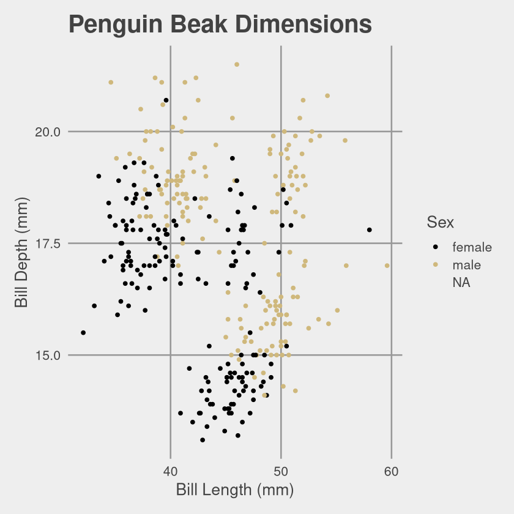
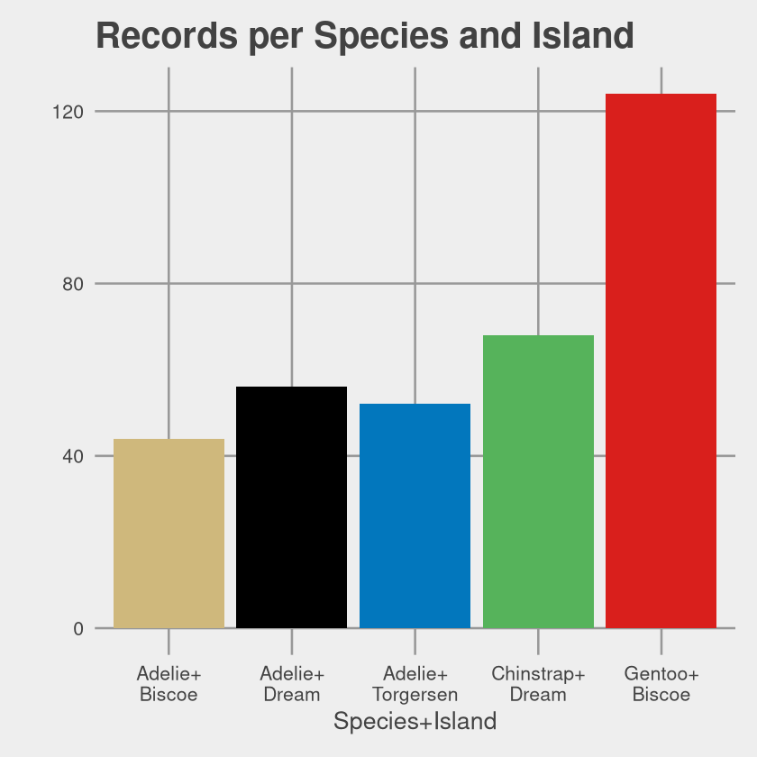

# Introduction
This package was put together to give the CU Boulder Office of Data Analytics a resource to help us keep our plots uniform in presentation and consistent with the [CU Boulder brand specifications](https://styleguide.colorado.edu/colors.html). It operates as a GGPlot theme, and can be installed directly from this repo. Usage is fairly simple, and is detailed below.

# Installation
To install this package run the following in either RStudio or your R console:
```
install.packages('devtools') # ignore if devtools already installed
devtools::install_github('cu-boulder/themeODA')
```

# Colors
The color palette implemented here includes three shades of gray (`dark gray`, `medium gray`, and `light gray`), taken directly from the CU Boulder web style guide, as well as a six color palette (`gold`, `black`, `blue`, `green`, `red`, and `purple`):


While the first three colors are taken directly from the guide, some adjustments were necessary for `green`, `red`, and `purple`. The green and red colors chosen by the style guide are not visually distinct from the `blue` and `black` used here, and `purple` is not included in the guide at all. Consistent with the style guide recommendations, these new colors were instead selected from the [Material Design](material.io) palette to maximize visual contrast with `gold`, `black`, and `blue`.

The priority of each color in the palette is indicated by their left-right ordering in the above palette image. While single-color plots will default to `black` (following `ggplot` defaults) `gold` isthe primary color for two-color plots, along with `black` as the secondary. The later colors, `blue`, `green`, etc. are only used as additional colors are required. In general, `red` and `purple` should be considered "low-priority", as both are difficult to distinguish from `blue` and `green` for people with colorblindness. If five or more colors are needed, it is reconmmended to consider using shape or other visual channels to improve plot legibility.

# Usage
The package has two components, a base theme (`theme_oda()`) and a set of scale functions (`scale_color_` and `scale_fill_`) to apply the color palette. These are illustrated below using the [penguins` example dataset](https://www.r-bloggers.com/2020/06/penguins-dataset-overview-iris-alternative-in-r/).


```R
library(ggplot2)
library(themeODA)
library(magrittr)
library(palmerpenguins)

# a simple scatterplot using the first two colors in the scale
scatter = ggplot(penguins,aes(x=bill_length_mm, y=bill_depth_mm, color=sex)) +
                 geom_point() +
                 # the base font size can be specified (base_size) as well as the presence of a legend
                 theme_oda(base_size=16, legend=TRUE) + 
                 scale_color_oda() +
                 labs(x='Bill Length (mm)', y='Bill Depth (mm)', title = 'Penguin Beak Dimensions',color='Sex')

scatter
```




```R
# themeODA also provides a gradient color scale, which defaults to black-gold
scatter.gradient = ggplot(penguins,aes(x=bill_length_mm, y=flipper_length_mm, color=body_mass_g)) +
    geom_point() + 
    theme_oda(base_size=16) +
    scale_color_oda_gradient() +
    labs(x='Bill Length (mm)',y='Flipper Length (mm)',title='Penguin Proportions', color='Body Mass (g)')

scatter.gradient
```


```R
# if additional visual contrast is required an intermediate color and be used
scatter.gradient = ggplot(penguins,aes(x=bill_length_mm, y=flipper_length_mm, color=body_mass_g)) +
    geom_point() + 
    theme_oda(base_size=16) +
    scale_color_oda_gradient(mid='blue') +
    labs(x='Bill Length (mm)',y='Flipper Length (mm)',title='Penguin Proportions', color='Body Mass (g)')

scatter.gradient
```


```R
# the scale_fill family provides functionality for histograms and bar charts
histogram = ggplot(penguins,aes(x=body_mass_g,group=species, fill=species)) + 
    geom_histogram() +
    theme_oda(base_size=16) +
    scale_fill_oda() +
    labs(x='Body Mass (g)', y='', title='Body Mass by Species', fill='Species')

histogram
```

    `stat_bin()` using `bins = 30`. Pick better value with `binwidth`.
    


```R
penguins$species.island = as.factor(paste0(penguins$species,'+\n',penguins$island))

bar = ggplot(penguins,aes(x=species.island,fill=species.island)) +
    geom_bar() +
    theme_oda(base_size=16, legend=FALSE) +
    scale_fill_oda() +
    labs(y='',x='Species+Island',title='Records per Species and Island',fill='Species+Island')

bar
```




